# Predicting salaries in the Greater Toronto Area: A Bayesian Approach
##### 15 min read
In this post, I present the main results of my master thesis in which I explore the application of bayesian inference for predicting salaries in the Greater Toronto Area (GTA). This work is designed as a component of the <a href="https://uttri.utoronto.ca/files/2018/07/ILUTE-Integrated-Land-Use-Transportation-and-Environment-Model-Reboot.pdf" target="_blank">ILUTE Framework</a> (Integrated Land-Use, Transportation, and Environment), an Agent‑Based simulation model for evaluating land use and transport interactions in urban areas.

## tl;dr
>Labour markets and transportation systems are at the core of urban life. Attributes such as residential and work locations, household income, and auto ownership are closely related to the interactions in the labour market. Since salaries are a key component of these interactions, predicting salaries becomes an important task for integrating labour market outcomes into travel behaviour modelling.

>Using a data-driven approach, we estimate a Bayesian hierarchical model to predict salary distributions in the Greater Toronto Area. The results of this work demonstrate that this approach provides better estimates at both the aggregated and disaggregated levels and generates more robust predictions by producing probability distributions instead of point estimates. This characteristic is key for using this model in an urban simulation setting such as the ILUTE framework.

## Hierarchical structure of labour markets
Labour markets are inherently hierarchical. Workers and firms are organized into different industries grouping the purpose and operations of a business within an economy. Similarly, workers can be classified into different occupations based on the tasks and skills required to perform the job. 

In terms of data structure, this relationship can be defined as *one-to-many*. One industry can contain many occupations that cover different processes and tasks. This hierarchy structure defines the category of each firm or worker belongs to and is highly correlated with the wage differentials observed across the labour market. This structure is key for the model specification detailed in the following sections.

<figure>
  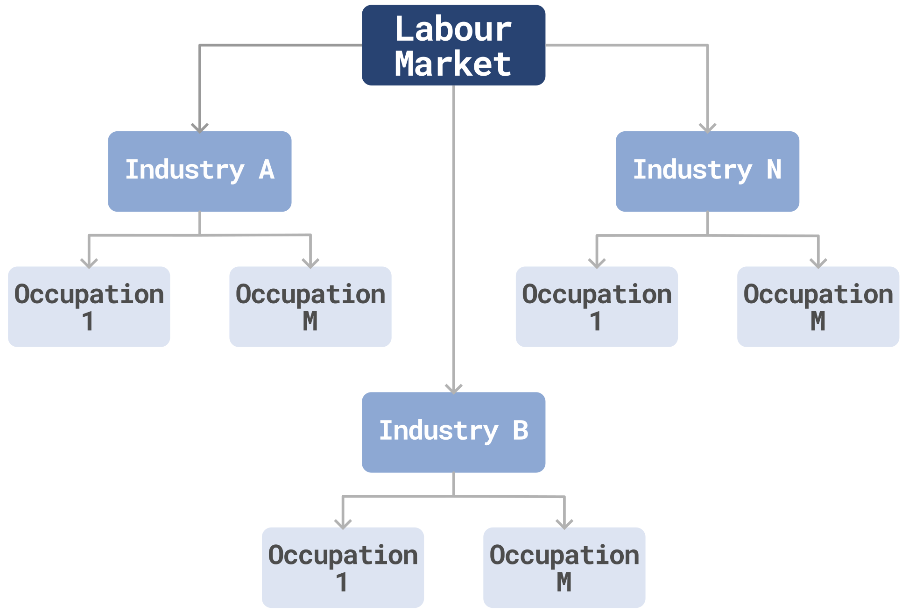
  <figcaption>Hierarchical structure of labour markets</figcaption>
</figure>

## Exploratory Data Analysis
Before defining the prediction model, it is important to understand the data generation process, which provides clues for guiding the model construction. This work was performed using the <a href="https://www150.statcan.gc.ca/n1/en/catalogue/75F0011X" target="_blank"> Survey of Labour and Income Dynamics - SLID</a> from Statistics Canada.

>The SLID dataset is split into two subsets, the *training* (\~70%) and the *validation* sets (\~30%). As the SLID survey is a *Longitudinal survey*, the training set corresponds to the records between 1993 to 2007 and the validation set to the period between 2008 to 2011. The former is used in the model parameters estimation while the latter is used to assess the model performance and predictive power.

As expected, the salary distribution in the GTA is *positive* and *right-skewed*, resembling continous distribution such as <a href="https://www.tandfonline.com/doi/full/10.1080/02664760902811571" target="_blank">Gamma distribution</a>, which is a common choice in the insurance and financial sector to model income and salaries.

<figure>
  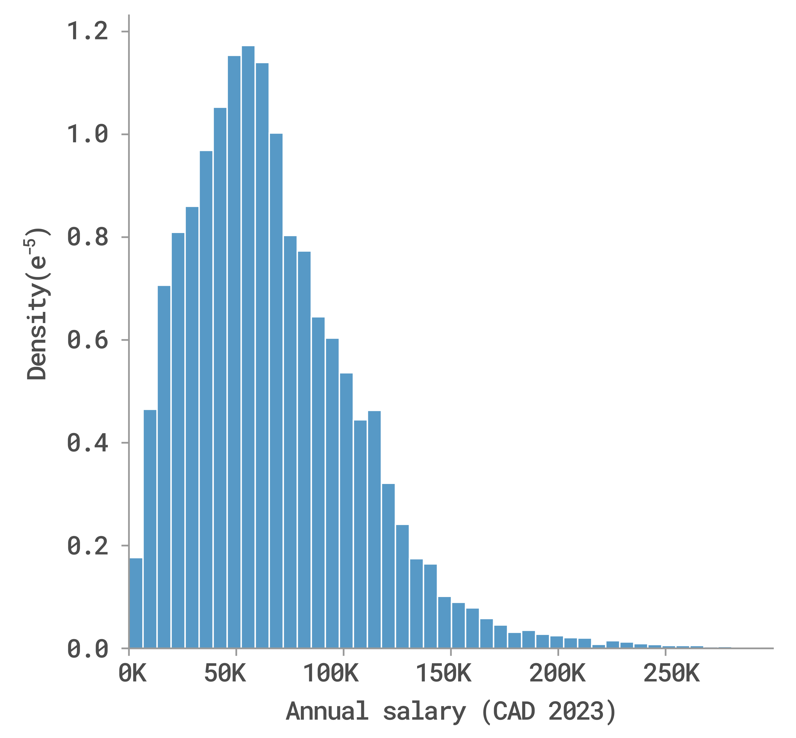
  <figcaption>Salary distribution in the GTA between 1993 and 2011</figcaption>
</figure>

The literature suggests that a person's level of education is a key factor in determining their salary, as it reflects the skills required to execute a job effectively. SLID data indicates that salaries in the GTA increase alongside educational attainment for both men and women, with this trend being more pronounced in males.

<figure>
  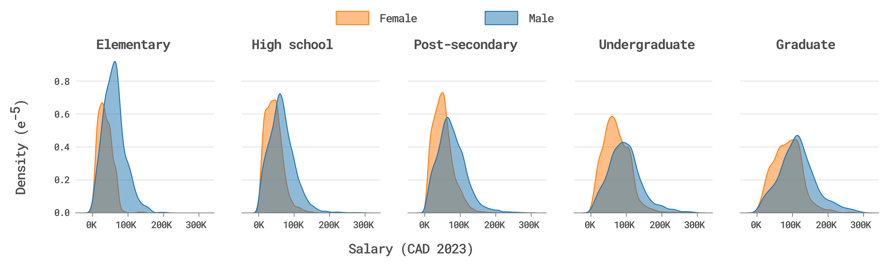
  <figcaption>Salary distribution by education level and gender</figcaption>
</figure>

While education level is a significant factor in explaining salary variability, additional features can play a crucial role in determining salary levels. Since certain industries and occupations require specific skills learned on-the-job, variables such as experience level, age, or job tenure might offer more comprehensive insights than solely considering educational attainment.

<figure>
  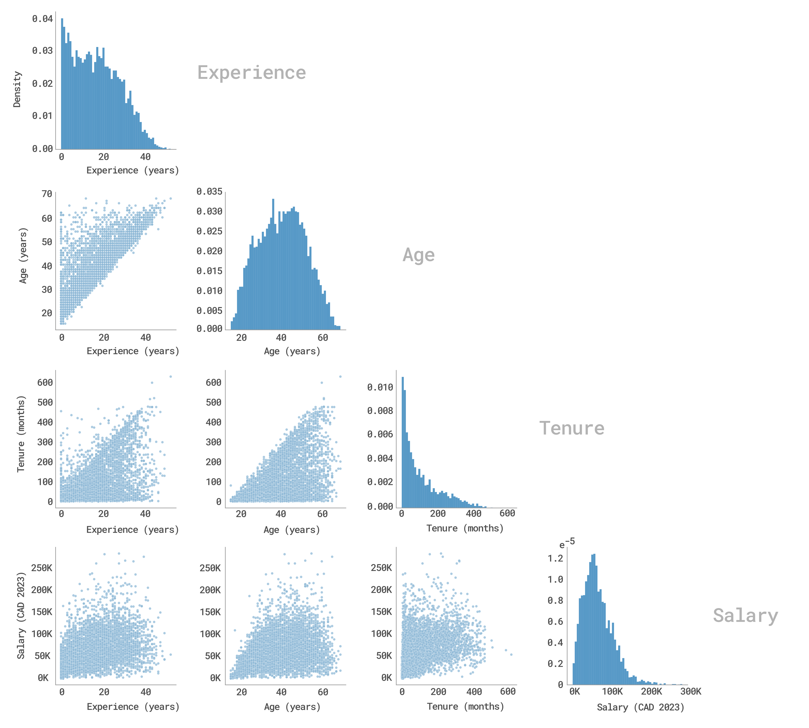
  <figcaption>Salaries by experience level, age, and tenure</figcaption>
</figure>

When data is filtered by industry and occupation, the linear relationship between experience, age, tenure, and salary becomes more explicit, as shown in the following chart. This finding supports the idea that the salary variability is closely related with the hierarchical structure of the labour market. This idea will be further explored in the next sections.

<figure>
  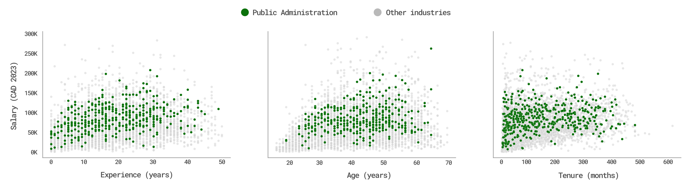
  <figcaption>Salary distribution by several attributes in the Public Administration industry</figcaption>
</figure>

## Model specification
From the EDA section, we observed that salaries are positive and right-skewed distributed, which resembles the Gamma distribution. On the other hand, the literature show how the salary of a particular worker can be explained by using a linear combination of different personal attributes. Hence, the model specification must meet this target distribution and the linearity requirements.

A model that meets these requirements is the <a href="https://www.utstat.toronto.edu/~brunner/oldclass/2201s11/readings/glmbook.pdf" target="_blank">Gamma Generalized Linear Model (Gamma GLM)</a>, which belongs to the family of linear models that represents a process in terms of a linear combination with error distribution different from the normal distribution, as in the ordinary linear regression

### Gamma GLM
Given a set of explanatory variables $X=[X_1,X_2,...,X_p]$ and a set of model parameters $\theta = [\theta_0,\theta_1,...,\theta_p]$, the Gamma GLM is defined by the following components:

* **Random component**: The response variable $Y$ follows a Gamma distribution defined by the parameters $\alpha$ and $\beta$ (shape and scale respectively). The expected value of this distribution is $\mu=\frac{\alpha}{\beta}$
    
$$f(y,\alpha, \beta)=\frac{\beta^\alpha}{\varGamma(\alpha)}y^{\alpha-1}e^{-\beta y} \quad \text{,} \quad y > 0$$

* **Systematic component**: The linear combination $\eta$ of explanatory variables $X$ and the model parameters $\theta$.

$$\eta = \theta_0 + \theta_1X_1+\theta_2X_2+...+\theta_pX_p$$

* **Link function**: This function connects the expected value of the target variable with the linear predictor $\eta$ using a log link and ensures that the linear predictor is positive and continuous. When solved for $\mu$, it provides the expectation over the target variable.

$$
\begin{align}
    log(\mu) &= \eta\\\\
    \mu &= e^{\eta}=e^{\theta_0+\theta_1X_1+...+\theta_pX_p}
\end{align}
$$

Hence, the inference process is focused on estimating the parameters $\theta$'s in the systematic component, whereas the parameters $\alpha$ and $\beta$ in the random component are inferred indirectly using the systematic component and the log-link function.

> As discussed in a ~~previous post~~, a hierarchical approach (a.k.a multilevel model) is the best approach to model data that is structured in a hierarchical way. Altough different configurations were tested in this work (pooled and no-pooled model), this post only present the details of the  **hierarchical model** and the comparison with the other alternatives.

### Hierarchical model

Previous sections have illustrated that labor markets are structured into various industries, with each industry encompassing a range of occupations. Within this framework, firms, jobs, and employees are categorized accordingly. The purpose of the hierarchical model is to capture the variability within each group (occupations) while also sharing information from higher levels (from industries). This implies that all jobs within a specific occupation inherit certain attributes from their respective industry.

This information sharing is achieved by setting a set of hyperpriors that defines the localization and scale of the prior distributions (prior parameters). In the hierarchical approach, the modeller only defines the shape of the prior distribution and lets the data select the best parameters for that prior based on the hyperpriors, as shown in the graph below.

<figure>
  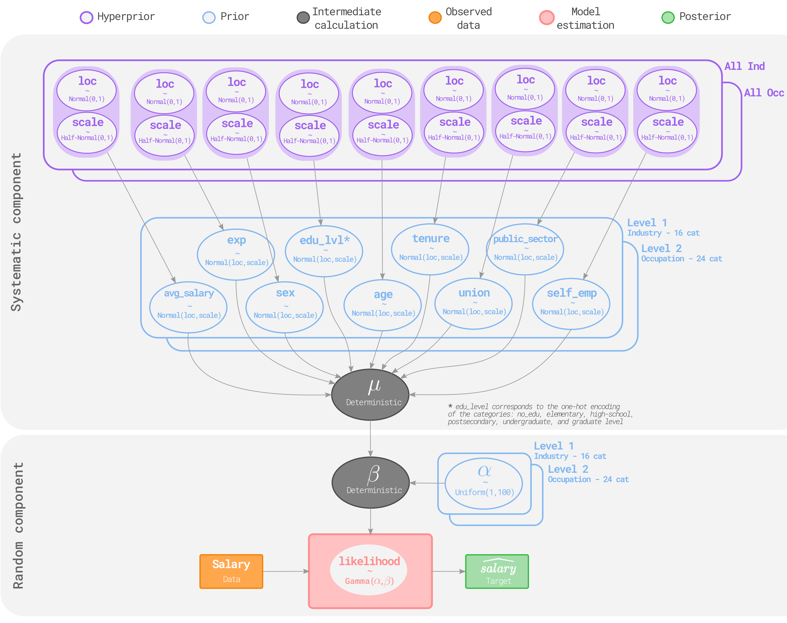\
  <figcaption>Hierarchical model graph</figcaption>
</figure>

### Model selection
After running the inference on the three model structures (pooled, no-pooled, and hierarchical), the results are compared using the <a href="http://www.stat.columbia.edu/~gelman/research/published/waic_understand3.pdf" target="_blank">Expected Log Pointwise Predictive Density - ELPD Score</a>. The model selection is divided into two sequential parts:
1) The *model structure selection*, which selects the best performing model between the pooled, no-pooled, and hierarchical structure. As expected, the hierarchical structure provides a higher predictive power than the pooled and no-pooled approach. Including the hyperpriors allows the model to better capture the complex relationships and dependencies in the data compared to the other approaches (pooled and no-pooled).

<figure>
  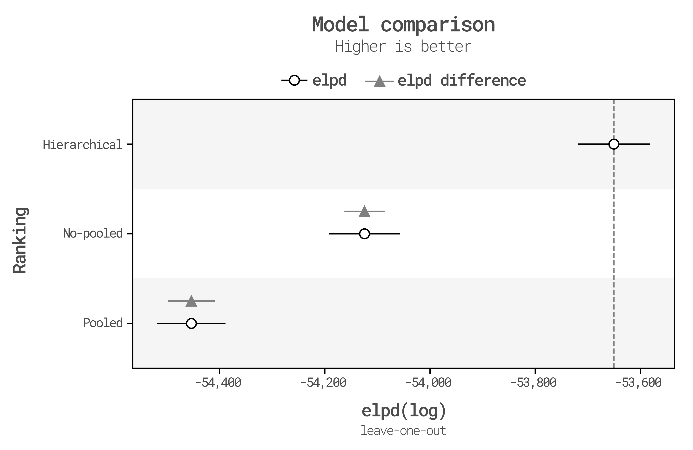
  <figcaption>Model structure selection</figcaption>
</figure>

2) Using the hierarchical model from the previous step, a *Forward selection* process is carry out to choose the most relevant features from the predictive perspective. This process starts from the most simple model (fixed effects or intercept model representing the average salary by industry and occupation) to the one that includes all variable set by adding one variable at each step.

    <figure>
      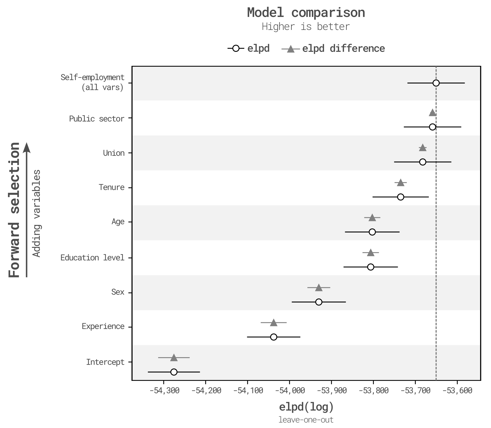
        <figcaption>Feature selection</figcaption>
    </figure>

    The variables with the most significant effect on the target variable are experience, sex, education, and employment sector. Conversely, variables such as age, tenure, and self-employment add little or no information at all, so they can be dropped from the model without losing significant performance. 
    
>This selection process helps to reduce the model complexity and reduces the risk of overfitting the data. The result from the 2-stage process is the optimal model used in the salary prediction for the GTA, which contains the predictors: **Avg_salary, Experience, Sex, Education, Union and Public Sector**.

Using the optimal model, the chart below shows a subset of the posterior distributions for some model parameters in some specific industries and occupations. This chart shows the effect of sharing information between different levels in the hierarchical approach as salaries for different occupations (Senior manager and Middle manager) within an industry are related.

<figure>
  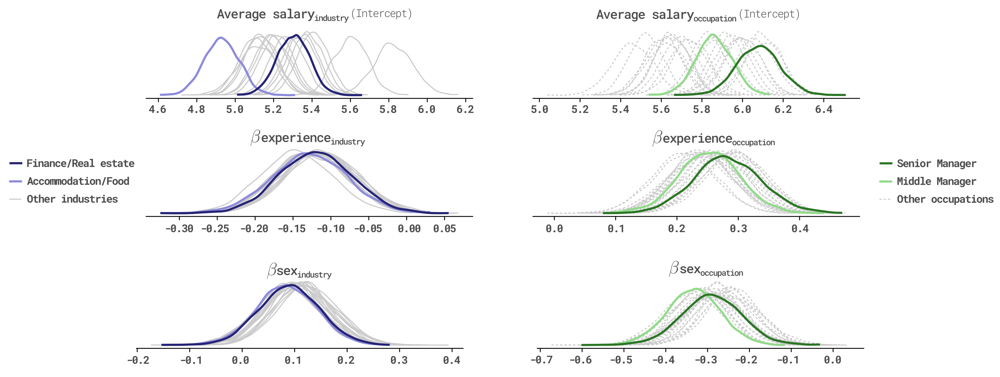
  <figcaption>Posterior distribution for a subset of model parameters in some specific industries and occupations</figcaption>
</figure>

## Model validation and results
A graphical comparison between the true and the estimated salary distribution for the validation dataset is carried out to assess the potential use of the predicted distributions in a simulation setting, such as the labour market module in the ILUTE framework. This validation is performed in two levels: the *aggregated* that ensures the model is correctly representing salaries within different clusters observed in the data (e.g. salary distribution by industry, occupation, gender, and education level, among others) and the *disaggregated* that ensures the salary is being correctly predicted for each worker given their attributes.

### Aggregated level
The following charts show a comparison between the true salary distribution and the predicted salary distribution for different group variables, being industry and occupation, the most relevant groups given the hierarchical structure of the labour market. From these figures, it is observed that the model adequately represents the salary across all group variables regarding their shape and values.

<figure>
  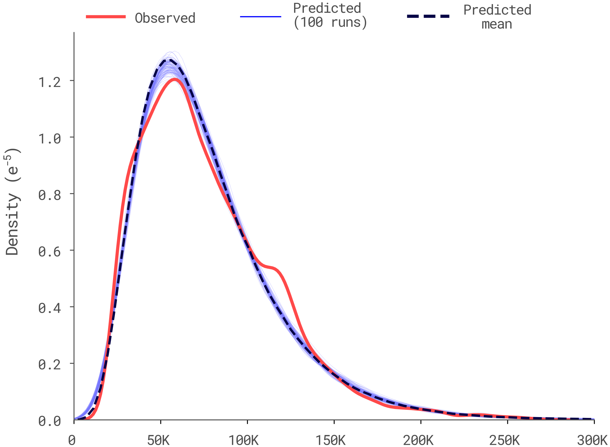
  <figcaption>Observed and predicted salary distribution for all individuals in the validation set</figcaption>
</figure>

<figure>
  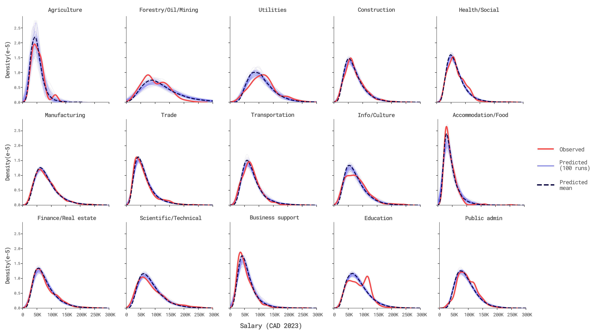
  <figcaption>Observed and predicted salary distribution by Industry (CAD 2023)</figcaption>
</figure>

<figure>
  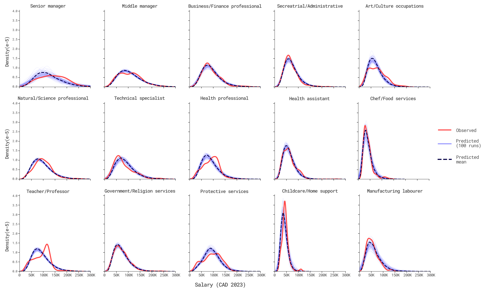
  <figcaption>Observed and predicted salary distribution by Occupation (CAD 2023)</figcaption>
</figure>

### Disaggregated level
For the disaggregated level, the chart below compares the following elements for a random set of
workers.
* **Observed salary**: salary reported by the worker in the SLID.
* **Predicted salary**: the expected value of the posterior salary distribution using the final model.
* **Posterior salary distribution**:  estimated salary distribution for that worker given their attributes.
* **Posterior salary distribution of similar workers**: This is the reference case to compare with the previous distribution (posterior salary distribution) and represents the average salary distribution of workers with the same attributes (variables used in the model estimation). This distribution also allows us to identify whether the observed salary is an outlier compared to workers with the same characteristics.

<figure>
  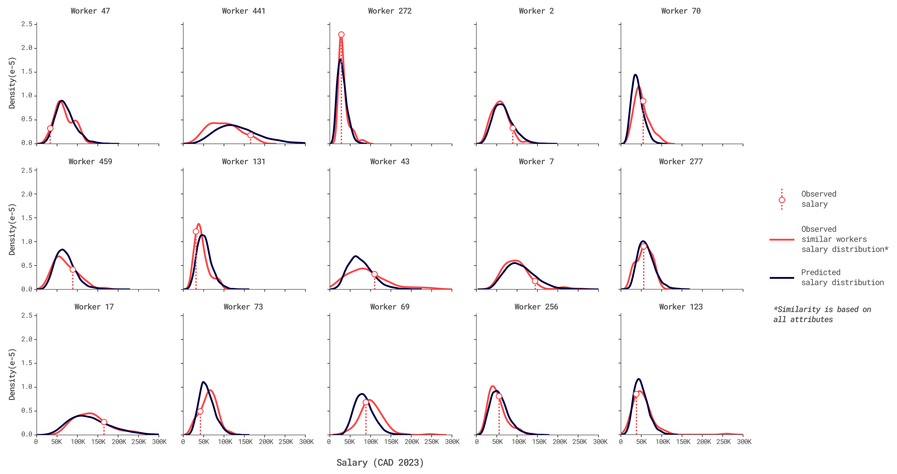
  <figcaption>Disaggregated analysis of salary distribution for 15 random selected workers within the validation dataset</figcaption>
</figure>

The comparison between these four elements provides a detailed perspective of the model’s ability to represent data at the disaggregated level. The comparison between the observed salary and the posterior salary distribution of similar workers illustrates the stochastic nature of salaries.

## Conclusions

The hierarchical structure in labour markets defines many attributes of both the firms and the individuals. According to the findings in this thesis, this structure is closely related with the observed wage differentials. Therefore, the inclusion of this structure in the modelling process will improve significantly the results and accuracy of the model by capturing the complex relationships between the multiple levels. 

Given the stochastic nature of simulations, the use of a random component seems to be more flexible and realistic than the use of point estimates to represent salaries within the labour market. As salaries are positive and right skewed, the application of the regular linear regression model could be misrepresenting the random component of salary definition. As suggested by the literature, the use of the Gamma distribution in conjunction with a systematic component improves the model performance and allows to capture the particularities of the observed salaries.

Besides the model structure, the application of the Bayesian inference framework allows to extract more information from the data by producing probability distributions instead of point estimates. This is more evident when modelling out-of-sample salary distributions at both the aggregated and disaggregated level with high accuracy and a good bias-variance balance, which demonstrates its potential to produce robust estimations. However, these advantages come with a cost in terms of computational power.

## Acknowledgments
* <a href="https://civmin.utoronto.ca/home/about-us/directory/professors/eric-miller/" target="_blank">Prof. Eric Miller</a> who guide and support this work.
* <a href="https://www.colfuturo.org/for-international-universities/about-colfuturo" target="_blank">COLFUTURO</a> for providing the partial funding for my graduate studies.
