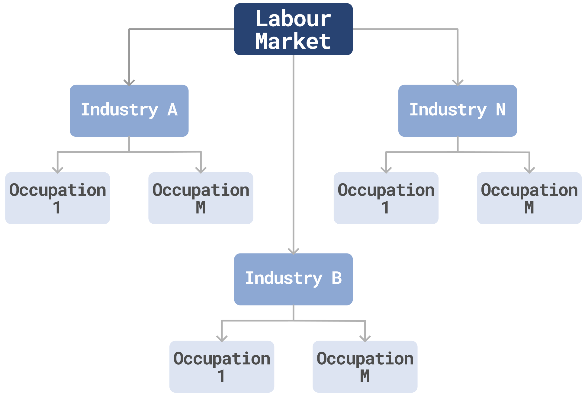

# Predicting salaries in the Greater Toronto Area: A Bayesian Approach
##### 15 min read
In this post, I present the main results of my master thesis in which I explore the application of bayesian inference for predicting salaries in the Greater Toronto Area (GTA). This work is designed as a component of the <a href="https://uttri.utoronto.ca/files/2018/07/ILUTE-Integrated-Land-Use-Transportation-and-Environment-Model-Reboot.pdf" target="_blank">ILUTE Framework</a> (Integrated Land-Use, Transportation, and Environment), an Agent‑Based simulation model for evaluating land use and transport interactions in urban areas.

## tl;dr
Labour markets and transportation systems are at the core of urban life. Attributes such as residential and work locations, household income, and auto ownership are closely related to the interactions in the labour market. Since salaries are a key component of these interactions, predicting salaries becomes an important task for integrating labour market outcomes into travel behaviour modelling.

Using a data-driven approach, we estimate a Bayesian hierarchical model to predict salary distributions in the Greater Toronto Area. The results of this work demonstrate that this approach provides better estimates at both the aggregated and disaggregated levels and generates more robust predictions by producing probability distributions instead of point estimates. This characteristic is key for using this model in an
urban simulation setting such as the ILUTE framework.

## Hierarchical structure of labour markets
Labour markets are inherently hierarchical. Workers and firms are organized into different industries grouping the purpose and operations of a business within an economy. Similarly, workers can be classified into different occupations based on the tasks and skills required to perform the job. 

In terms of data structure, this relationship can be defined as *one-to-many*. One industry can contain many occupations that cover different processes and tasks. This hierarchy structure defines the category of each firm or worker belongs to and is highly correlated with the wage differentials observed across the labour market. This structure is key for the model specification detailed in the following sections.

<figure>
  
  <!-- <figcaption>Hierarchical structure of labour markets</figcaption> -->
</figure>

## Exploratory Data Analysis
Before defining the prediction model, it is important to understand the data generation process, which provides clues for guiding the model construction. This work was performed using the <a href="https://www150.statcan.gc.ca/n1/en/catalogue/75F0011X" target="_blank"> Survey of Labour and Income Dynamics - SLID</a> from Statistics Canada. As expected, the salary distribution in the GTA is *positive* and *right-skewed*, resembling continous distribution such as <a href="https://en.wikipedia.org/wiki/Gamma_distribution" target="_blank">Gamma distribution</a>, which is a common choice in the insurance and financial sector to model income and salaries.

<figure>
  
  <!-- <figcaption>Hierarchical structure of labour markets</figcaption> -->
</figure>

## Model specification

## Model validation and results

## Conclusions

## Acknowledgments
